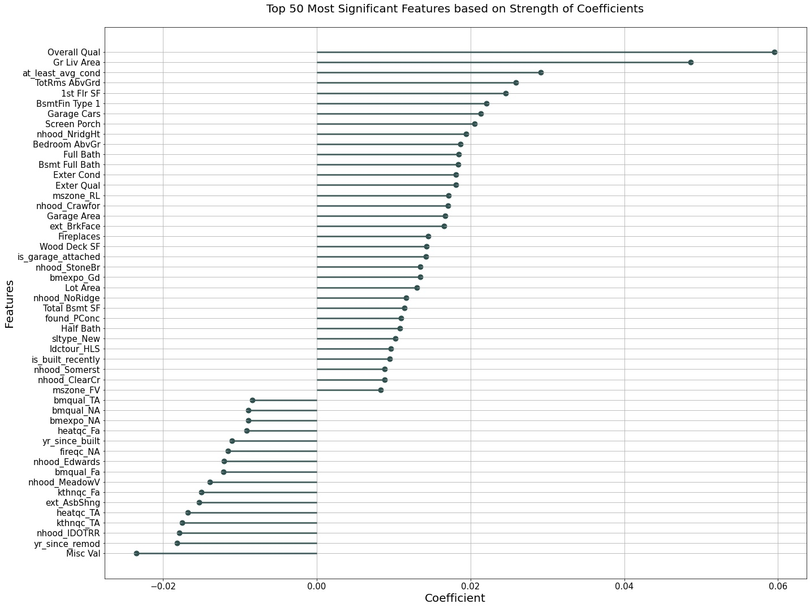
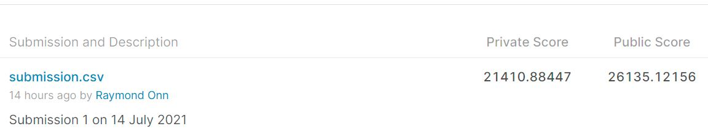

## Project 2: Ames Housing Data and Kaggle Challenge

### Exectuve Summary
In the real estate market, housing prices are determined by the attributes of the property itself and by the characteristics of the neighbourhood within which it resides. This method of pricing is known as hedonic pricing. It is reasonable to expect internal factors (such as property size) and external factors (such as availability of amenities) to have an impact on housing prices. The attributes and characteristics that are believed to have a considerable impact on housing prices were selected. 

This project aims to help real estate buyers and sellers predict the price of a house in Ames, Iowa based on a set of property- and neighbourhood-specific traits. The prediction will be made with the best linear regression model as evaluated by R-Squared and Root Mean Squared Error(RMSE). 

Three linear regression models (Ordinary Least Squares, Ridge, Lasso) were evaluated. Prior to model fitting, the dataset was first put through a variance threshold with the threshold set at 0.01, allowing features with variance 0.01 or higher to pass through. Next, the features are normalized using the Standard Scaler after splitting the dataset into training and testing sets. During, model fitting, 5-fold cross validation was done on the train dataset for all three models. Subsequently, the models were tested using the test dataset

At the end, Ridge Regression was selected as the model of choice with the highest test R-squared score at 0.905 and the lowest test RMSE at 0.1246.The Ridge model also outperformed the Null model, which gave a baseline R-Squared of 0.00 and a baseline RMSE of 0.4111

The 5 biggest determinants of housing sale price were found to be 
* Overall Quality 
* Above Ground Living Area, 
* having at least average condition, 
* Total rooms above ground
* the 1st Floor Area

This makes sense as buyers do not want to rebuild the house all over again. Hence, they generally expect the house of be of a certain quality and condition. 
Above ground living area, total rooms above ground and 1st floor area can be seen as proxy for the land area of the property as by buying the property, buyers essentially have ownership over the land for which the property sits. The more land you purchase, the higher the price.

###  Overview
In the real estate market, housing prices are determined by the attributes of the property itself and by the characteristics of the neighbourhood within which it resides. (source) This method of pricing a marketed good is known as hedonic pricing, wherein an item is treated as the sum of its individual qualities that cannot be sold separately in the market, with the objective of estimating the extent to which each of these qualities affect the market price of the item. (source)

Hedonic pricing is used traditionally to estimate economic values for environmental or ecosystem services that directly affect market prices. (source) Essentially, the basic premise of the hedonic pricing method is that the price of a marketed good is related to its traits. (source)

With respect to housing prices, it is reasonable to expect internal factors (such as property size, age, material quality, physical condition, and features like fireplaces or pools) and external factors (such as availability of amenities, proximity to public transportation, crime rate, socioeconomic status of households, and level of air or water pollution) to have an impact on housing prices. (source) The attributes and characteristics that are believed to have a considerable impact on housing prices were selected as the starting features for the development of the predictive model.

### Problem Statement
This project aims to help uninformed home sellers understand what constitute as fair housing prices by developing a regression model to predict the sale prices of houses. Specifically, we use regression models, i.e. Ordinary Least Squares (OLS), Ridge and Lasso regressions.

The goal is to have a housing price prediction model that will be able to predict the housing prices with error term or root mean squared error (RMSE) that is ideally lower than $10,000 (i.e. cost of imperfection information in the housing market).

### Data Dictionary

 A description of the variables in the original datasets, train.csv and test.csv, can be found at their source over [here](http://jse.amstat.org/v19n3/decock/DataDocumentation.txt).
 
### Top 50 features

### Result & Analysis
A total of 3 regression models were evaluated. The models considered were the normal linear regression, Ridge regression and the LASSO regression. Evaluation was done on the basis of R-squared and Root Mean Squared Error(RMSE)

Prior to model fitting, the dataset was first put through a variance threshold with the threshold set at 0.01, allowing features with variance 0.01 or higher to pass through. Next, the features are normalized using the Standard Scaler. 

During, model fitting, 5-fold cross validation was done on the train dataset for all three models. Subsequently, the models were tested using the test dataset

All in all, The Ridge model was selected as the model of choice as it scored the highest R-Squared and the lowest Root Mean Squared Error(RMSE) on the testing dataset. Test R-squared score was 0.905 and the test RMSE was 0.1246. The Ridge model also outperformed the Null model, which gave a baseline R-Squared of 0.00 and a baseline RMSE of 0.4111

The 5 biggest determinants of housing sale price were found to be 
* Overall Quality 
* Above Ground Living Area, 
* having at least average condition, 
* Total rooms above ground
* the 1st Floor Area

This makes sense as buyers do not want to rebuild the house all over again. Hence, they generally expect the house of be of a certain quality and condition. 
Above ground living area, total rooms above ground and 1st floor area can be seen as proxy for the land area of the property as by buying the property, buyers essentially have ownership over the land for which the property sits.
The more land you purchase, the higher the price.

### Kaggle Results 
Link to the Kaggle Challenge: [DSI-US-11 Regression Challenge](https://www.kaggle.com/c/dsi-us-11-project-2-regression-challenge)  \
The Lasso Regression was selected to generate the final predictions due to having the lowest risk for overfitting

Here's how well my submission did.

